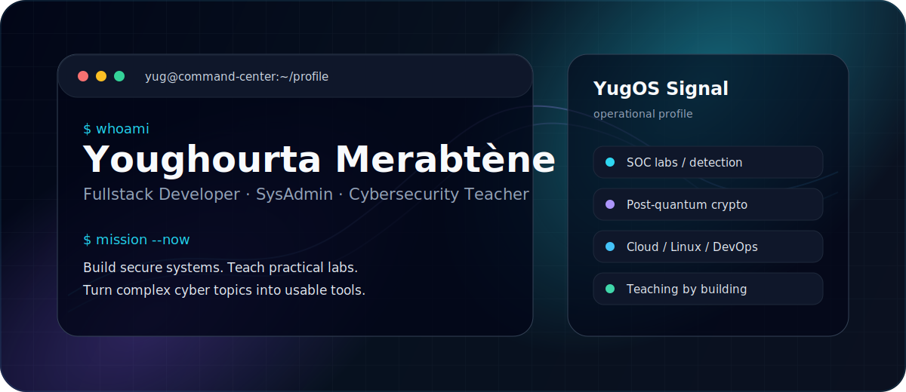

<p align="center">
  
</p>

<p align="center">
  <a href="https://yug.be"></a>
  <a href="mailto:yug@yug.be"></a>
  <a href="https://www.linkedin.com/in/youghourta-merabt%C3%A8ne-76885b210/"></a>
  <a href="https://twitter.com/yugmerabtene"></a>
</p>

<p align="center">
  
  
  
  
  
</p>

---

## Operator Brief

I design and teach practical systems: fullstack apps, Linux infrastructure, cybersecurity labs, cloud foundations, and secure development workflows. My profile is not only a portfolio; it is a public lab bench for students, builders, and security-minded engineers.

```txt
Identity      Fullstack Developer / System Administrator / Cybersecurity Teacher
Signal        Build secure tools, explain hard topics, ship reproducible labs
Research      SOC workflows, post-quantum crypto, x86 assembly, secure systems
Contact       yug@yug.be
```

---

## Command Deck

<table>
  <tr>
    <td width="25%" valign="top">
      <strong>01 / Build</strong><br />
      APIs, backend services, Java/Spring, Python tooling, Django, PHP, frontend foundations.
    </td>
    <td width="25%" valign="top">
      <strong>02 / Defend</strong><br />
      Blue team labs, SOC pipelines, log analysis, vulnerability detection, secure coding.
    </td>
    <td width="25%" valign="top">
      <strong>03 / Deploy</strong><br />
      Linux, Docker, Kubernetes, AWS, monitoring, networking, automation, documentation.
    </td>
    <td width="25%" valign="top">
      <strong>04 / Teach</strong><br />
      Courses, workshops, roadmaps, practical labs, exams, student projects, mentoring.
    </td>
  </tr>
</table>

---

## Active Radar

| Track | Current Direction | Public Signal |
| --- | --- | --- |
| Cyber SOC | Detection, alerting, dashboards, reports, Docker labs | [PROJET-M2-CYBER-2026](https://github.com/yugmerabtene/PROJET-M2-CYBER-2026) |
| Blue Team | Defensive security foundations and practical training | [BLUE-TEAM](https://github.com/yugmerabtene/BLUE-TEAM) |
| Crypto | Post-quantum cryptography experiments and notes | [CRYSTALS-KYBER-CRYSTALS-DILITHIUM](https://github.com/yugmerabtene/CRYSTALS-KYBER-CRYSTALS-DILITHIUM) |
| Education | Web, cloud, cyber, Java, Python, DevOps courses | [FISE-ESIEA-WEBDEV-2025](https://github.com/yugmerabtene/FISE-ESIEA-WEBDEV-2025) |
| Tooling | CVE/network scanner and practical security utilities | [VULNYER](https://github.com/yugmerabtene/VULNYER) |
| Low Level | Language design, x86 assembly, DSA learning | [KDX](https://github.com/yugmerabtene/KDX) |

---

## Stack Console

<p align="center">
  
</p>

<p align="center">
  
  
  
  
</p>

---

## Field Notes

```txt
Readable beats clever.
Practical beats theoretical-only.
Secure-by-design beats patched-later.
Teaching forces clarity.
Labs make knowledge real.
```

<p align="center">
  <strong>Open to collaboration on cybersecurity labs, education platforms, secure systems, and useful developer tools.</strong>
</p>

<p align="center">
  <a href="https://yug.be">yug.be</a> / <a href="mailto:yug@yug.be">yug@yug.be</a> / Coding since 2004
</p>
